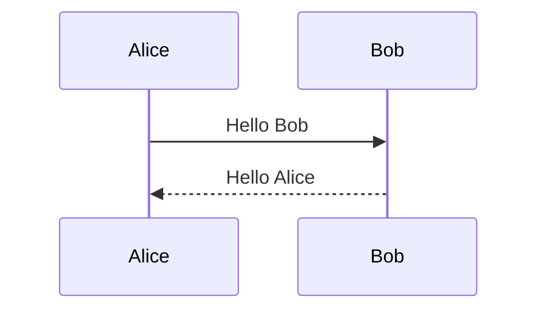

+++
title = "Your First Post"
date = 2024-11-01
description = "A placeholder post to verify the blog section is working."

[taxonomies]
tags = ["meta", "writing"]

[extra]
lang    = "en"
math    = false
mermaid = false
copy    = true
comment = false
reaction = false
+++

This is a placeholder post. Delete it and add your own posts to
`content/posts/YYYY-MM-DD-your-title.md`.

## Front matter reference

Every post uses this front matter structure:

```toml
+++
title = "Post Title"
date = 2024-01-15
description = "One sentence summary for search and social cards."

[taxonomies]
tags = ["tag1", "tag2"]

[extra]
lang    = "en"
math    = false   # set true for KaTeX, "mathjax" for MathJax
mermaid = false
copy    = true
comment = false
+++
```

## Math example (when math = true)

Inline: $E = mc^2$

Display:

$$\int_{-\infty}^{\infty} e^{-x^2}\, dx = \sqrt{\pi}$$

## Code example

```python
def hello(name: str) -> str:
    return f"Hello, {name}!"
```

## Mermaid example (when mermaid = true)


