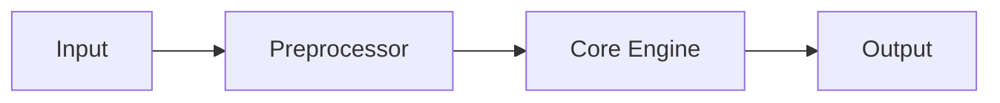

+++
title = "Getting Started"
description = "Install and run Demo Project in five minutes."
weight = 1

[extra]
lang            = "en"
sidebar_section = "Introduction"
math    = false
mermaid = true
copy    = true
comment = false
+++

## Prerequisites

List what the user needs before installing.

## Installation

```bash
git clone https://github.com/PLACEHOLDER/demo-project
cd demo-project
pip install -e .
```

## Quick start

```python
from demo_project import run

result = run(input="hello")
print(result)
```

## Architecture overview

Here is a Mermaid diagram showing the high-level architecture:



Continue to the [API Reference](../api-reference/) for full details.
